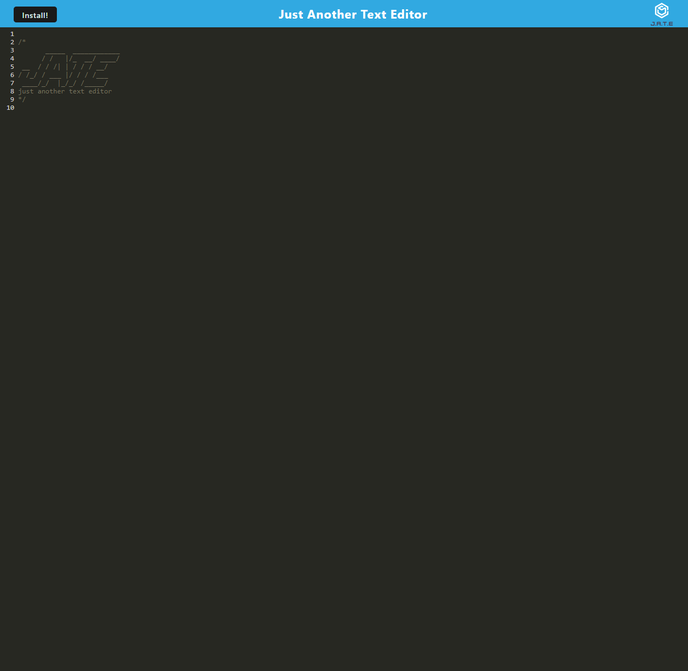

# J.A.T.E Text Editor

## Description
J.A.T.E, which stands for just another text editor, is a text editor that runs inside the browser. It is a single page application where you can save code, text, notes, etc. The data you enter into the text editor will be saved and retrieved through an InexedDB database. This way you can close the application and reopen it at any time without losing your text. Even if you are offline, the data will still persist. You can also download the application as an icon to your desktop where you can pin it to your taskbar for easy access.

## Installation
All that is required is a device with access to a web browser.

## Usage
Upon opening the application, you will be taken right to the text editor. You can begin typing away, pressing the "enter" key to start new lines. You can close and reopen the app at any time and your data will persist. You can also choose to install the app as an icon if you wish. You will be able to right click and select pin to taskbar and it will be place on your taskbar for quick access. You can also uninstall by selecting the three dots in the upper right hand corner and selecting uninstall.

## Live Application
[Click this to be taken to the live site](https://obscure-dusk-06280-0a33e7d3f0b4.herokuapp.com/)

